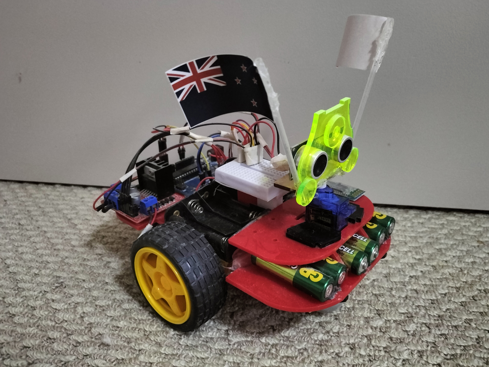

# Bluetooth controlled Arduino Robot
- 1 x Arduino Uno r3
- 1 x L298N Dual Bridge (Stepper Controller Motor Driver module)
- 1 x Ultrasonic sensor
- 1 x Breadboard
- 2 x Gear Box
- 1 x Chassis

Preview

